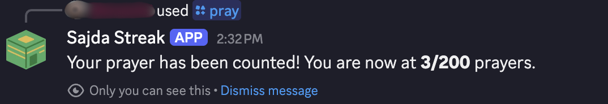
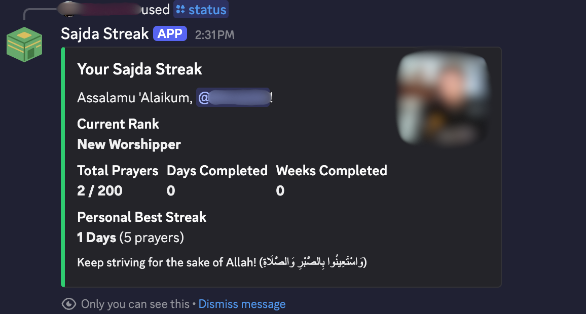
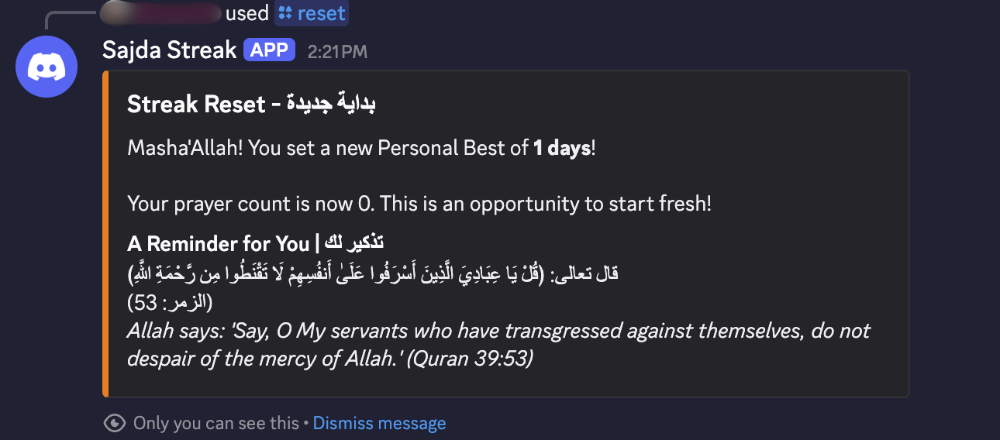
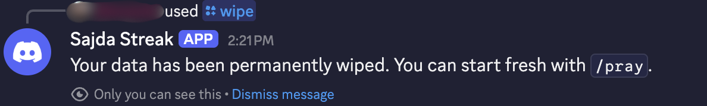

# Sajda Streak 🤖

A motivational Discord bot for tracking your daily masjid prayers and celebrating every milestone on the road to 40 consecutive days streak!
The bot tracks and responds privately, to avoid invoking Reya'a, and is meant as a tool to help brothers stay consistent in congregations.

## Screenshots

### '/pray' command


### '/status' command


### '/reset' command


### '/wipe' command
 

---

## Features

*   **Updates Per Prayer:** Keep your streak alive by simply updating it after every prayer.
*   **Simple Commands:** Easy-to-use commands like `/pray`, `/status`, `/reset`, and `/wipe`.
*   **24/7 Uptime:** Ready to use whenever you need it.
*   **Secure:** Built with security in mind, using environment variables for API keys.

---

## Tech Stack


---

## Setup & Installation

Follow these instructions to get a copy of the project up and running on your local machine for development and testing purposes.

### Prerequisites

*   Python 3.8+
*   A Discord account and a server where you have administrative privileges.
*   A Discord Bot Token. You can find instructions on how to get one [here](https://discordpy.readthedocs.io/en/stable/discord.html).

### Installation

1.  **Clone the repository:**
    ```bash
    git clone https://github.com/your-username/your-repo-name.git
    cd your-repo-name
    ```

2.  **Create and activate a virtual environment:**
    ```bash
    # For macOS/Linux
    python3 -m venv venv
    source venv/bin/activate

    # For Windows
    py -m venv venv
    venv\Scripts\activate
    ```

3.  **Install the required dependencies:**
    ```bash
    pip install -r requirements.txt
    ```

### Configuration

This project uses environment variables to handle sensitive API keys and tokens.

1.  Create a file named `.env` in the root of the project.
2.  Copy the contents of `.env.example` into your new `.env` file.
    ```
    # .env.example
    BOT_TOKEN="YOUR_DISCORD_BOT_TOKEN_HERE"
    ANOTHER_API_KEY="YOUR_OTHER_API_KEY_HERE"
    ```
3.  Replace the placeholder values with your actual Discord Bot Token and any other API keys you are using.

---

## Running the Bot

Once you have completed the installation and configuration, you can run the bot with the following command:

```bash
python main.py
```

## Usage

Here are some of the commands you can use in your Discord server:

*   `/pray` - Log one prayer in the mosque. Adds +1 to your streak.
*   `/status` - Check your current prayer streak status.
*   `/reset` - Reset your streak to 0. Saves your best streak.
*   `/wipe` - Deletes ALL your data permanently. Requires confirmation.

---

## License

This project is licensed under the MIT License - see the [LICENSE](LICENSE) file for details.